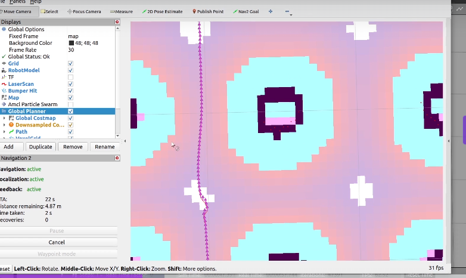
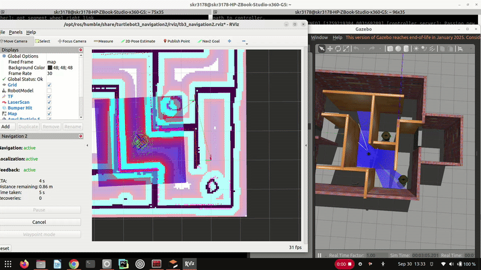
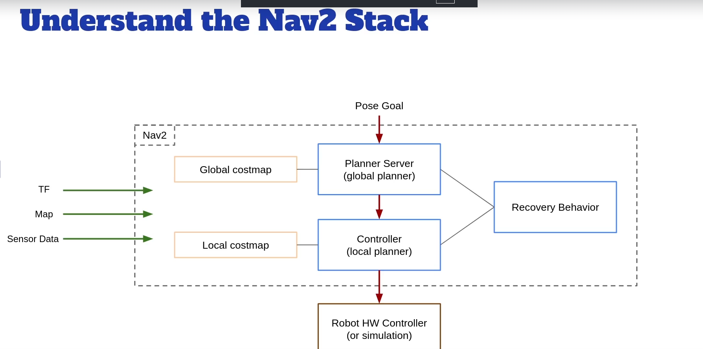
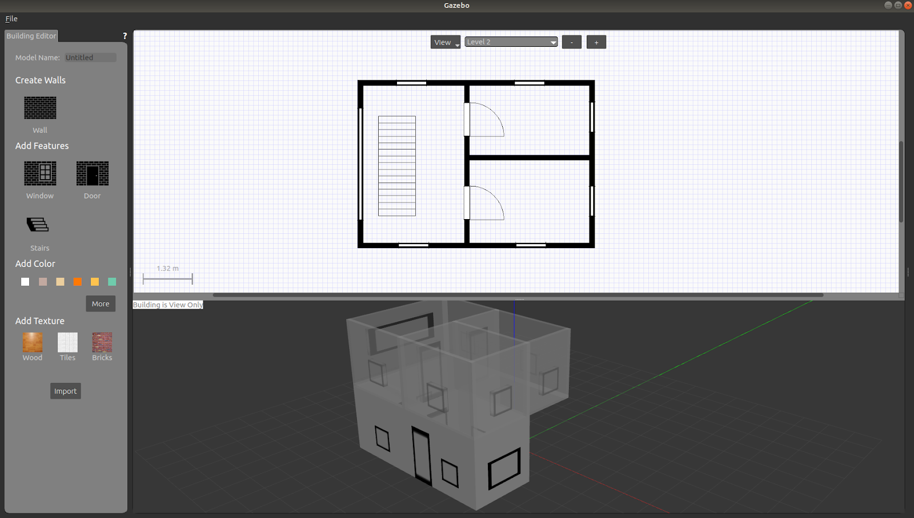
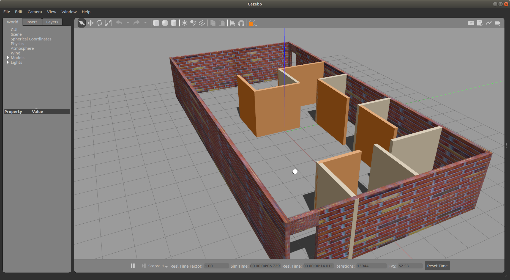

# ROS2 Navigation Stack (Nav2) Course

Course from Udemy: [ROS2 Nav2 Stack](https://www.udemy.com/course/ros2-nav2-stack/learn/)

## Overview

This repository contains projects and exercises for learning ROS2 Navigation Stack (Nav2) using TurtleBot3 in Gazebo simulation. The course covers SLAM (Simultaneous Localization and Mapping), autonomous navigation, and the complete Nav2 stack implementation.

## Environment Setup

- **ROS 2 Distribution**: Humble
- **OS**: Ubuntu 22.04
- **Simulator**: Gazebo Classic
- **Robot Platform**: TurtleBot3 (Burger/Waffle/Waffle Pi)

### Prerequisites

If you encounter errors when starting Gazebo Classic with TurtleBot3, run:
```bash
. /usr/share/gazebo/setup.sh
```

For better performance with RViz and Gazebo, install CycloneDDS:

```bash
sudo apt install ros-humble-rmw-cyclonedds-cpp
export RMW_IMPLEMENTATION=rmw_cyclonedds
source /opt/ros/humble/setup.bash
```

Gazebo : User Interface tool to interact with the robot and the movement

RViz: User interface tool to view the different publisher, subscriber, sensors such as lidars, etc output. 

On the first env of Turtlebot sim, one can create a map of the world by navigating using keyboard teleoperation. The map is saved @ /home/skr/ros2_nav/maps/maps2/my_map2.pgm

The map is further cleaned up using tool GIMP.

On Gazebo, there are options to navigate to a particular point or pose. This can be achieved using ther energy estimates of curves. 

One can then place a custom robot inside these maps and navigate to the particular location say a factory floor. 

It is also possible to stitch maps generated from 2 different sessions (consider a large room which is tricky and tedious to be mapped in the first trial). 

These custom maps can be saved in maze.world and my_world.world




1. local energy estimates which is intimately followed
2. global energy estimates which provides a longer term format of navigating to a particular location.


Navigating across using RViz and Gazebo is shown in this sample example.




TF shows the transform of the different parts based on the base. This is accomplished through a series of transformations between different corrdinate frames. In ROS, each frame can have only one parent.



## Repository Structure

```
ros2_nav/
├── turtlebot3_gazebo/          # TurtleBot3 Gazebo simulation package
│   ├── launch/                 # Launch files for different worlds
│   ├── models/                 # Robot and world models
│   ├── worlds/                 # Gazebo world files
│   └── urdf/                   # Robot description files
├── ros2_building_editor/       # Custom world building editor
├── maps/                       # Generated maps and SLAM documentation
│   └── maps2/                  # Saved map files
├── building_editor_models/     # Custom building models
├── maze.world                  # Maze world file
├── my_world.world             # Custom world file
├── command.md                  # Quick reference commands
└── reference.txt              # Configuration reference and notes
```

## Course Content

### 1. SLAM (Simultaneous Localization and Mapping)

Creating maps of unknown environments using Cartographer:

```bash
# Launch Gazebo with TurtleBot3 in house environment
ros2 launch turtlebot3_gazebo turtlebot3_house.launch.py

# Start Cartographer SLAM
ros2 launch turtlebot3_cartographer cartographer.launch.py use_sim:=True

# Control robot with keyboard
ros2 run turtlebot3_teleop teleop_keyboard

# Save the generated map
ros2 run nav2_map_server map_saver_cli -f maps2/my_map2
```

**Map Configuration** (YAML):
- `image`: Map image file (.pgm)
- `resolution`: Pixel size in meters (e.g., 0.05)
- `origin`: Lower-left corner coordinates [x, y, theta]
- `occupied_thresh`: Threshold for occupied space (0.65)
- `free_thresh`: Threshold for free space (0.25)
- `negate`: Invert colors (0 or 1)

**Map Color Coding**:
- **White**: Open/free space
- **Black**: Obstacles
- **Grey**: Unknown areas

### 2. Navigation (Nav2)

Autonomous navigation from point A to point B using pre-generated maps.

**Key Concepts**:
- **Cost Maps**: Areas with high collision risk have higher cost values
- **Global Planner**: High-level path planning (like GPS)
- **Local Planner**: Real-time obstacle avoidance and local trajectory planning


To create customs maps with walls, windows, doors etc one can create using the Gazebo graphic user interface from the floor layout. Use the building editor tool




### 3. Transform Frames (TF)

Understanding the relationship between coordinate frames:

1. **map**: Global reference frame (stable, can jump)
2. **odom**: Odometry frame (estimated from wheel encoders, accumulates error)
3. **base_footprint**: Robot's base frame

**Key Relationships**:
- `map → base_footprint`: Stable in long run, can jump during corrections
- `odom → base_footprint`: Smooth but accumulates error over time
- ROS2 enforces single-parent rule for transforms

**Visualize TF Tree**:
```bash
ros2 run tf2_tools view_frames
```

### 4. Building Editor

Custom world creation using the Gazebo Building Editor for designing custom environments and floor plans.

## Common Commands

### Launch Simulations

```bash
# Empty world
ros2 launch turtlebot3_gazebo empty_world.launch.py

# House environment
ros2 launch turtlebot3_gazebo turtlebot3_house.launch.py

# Custom world
ros2 launch turtlebot3_gazebo turtlebot3_my_world.launch.py

# TurtleBot3 world
ros2 launch turtlebot3_gazebo turtlebot3_world.launch.py
```

### Process Management

Check running Gazebo/RViz processes:
```bash
ps aux | grep -E "(rviz|gazebo)" | grep -v grep
```

Kill processes:
```bash
kill -9 <PID>
```

## Visual Resources

- `nav_stack.png`: Nav2 stack architecture diagram
- `cost_map.png`: Cost map visualization
- `floorplan_example.png`: Building editor example
- `Nav2.gif`: Navigation demonstration

## Research Questions & Advanced Topics

- LLM integration for navigation planning
- Multi-robot SLAM and coordination
- Cross-platform mapping (drone → humanoid)
- Advanced path planning algorithms

## References

- [SLAM Steps Documentation](maps/SLAM+Steps+(ROS2+Nav2+Course+-+Section+3).pdf)
- [Navigation Steps Documentation](maps/Navigation+Steps+(ROS2+Nav2+Course+-+Section+4).pdf)
- TF Frames Visualization: `maps/frames_2025-09-27_20.29.02.pdf`

## Learning Outcomes

By completing this course, you will understand:
- ✅ SLAM algorithms and map creation
- ✅ Nav2 stack architecture and configuration
- ✅ Autonomous robot navigation
- ✅ Transform (TF) trees and coordinate frames
- ✅ Cost maps and path planning
- ✅ Gazebo simulation and world building
- ✅ TurtleBot3 robot platform

## Notes

- Accurate maps are crucial for effective navigation
- Without a good map, the robot cannot reliably navigate to set points
- Global planner handles overall path, local planner handles immediate obstacles
- Understanding TF relationships is fundamental to ROS2 robotics
